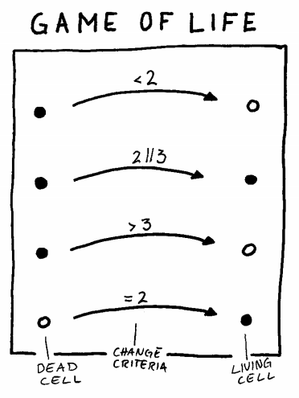

# Remote Global Day of the Coderetreat

El [Global Day of the Coderetreat](https://www.coderetreat.org/) consiste en dedicar una jornada completa a la práctica deliberada, centrándose en los principios fundamentales del desarrollo de software y no en completar una funcionalidad concreta. Todo ello con el único objetivo de mejorar nuestras mecánicas de desarrollo, diseño, testing y refactoring.

El formato del Coderetreat comporta una serie de restricciones que nos auto-imponemos, y que hacen que sea realmente interesante afrontar el desafío que representa.

Principalmente la actividad del evento se centra en completar múltiples iteraciones de 45 minutos de duración, por parejas y haciendo TDD, de forma que nuestro foco se centre siempre en las formas y no en completar un problema que es bastante complejo ya por si y que sólo nos sirve como hilo conductor del evento: [El juego de la vida de Conway](https://en.wikipedia.org/wiki/Conway%27s_Game_of_Life).

En 2019, el [Global Day of the Coderetreat](https://www.coderetreat.org/) se organiza a nivel mundial el 16 de Noviembre y, aunque habitualmente los Coderetreat se realizan en un localización física y se hacen "cara a cara", nuestro objetivo es destilar la esencia de este tipo de eventos para trasladarla al plano remoto.

# ¿Cómo puedo participar?

Una de las ventajas de ser un Coderetreat remoto es que no tenemos aforo máximo, aunque para esta edición vamos a limitarlo a 100 personas. Si quieres participar únicamente tienes que completar la inscripción enviándonos un *pull request* con tus datos siguiendo este JSON al directorio `people`:

```json
{
  "nombre": "Tu nombre completo",
  "twitter": "Tu handler de twitter sin la @",
  "slack": "@TuHandleDeSlack",
  "ciudad": "Desde que ciudad del mundo te conectarás",
  "dirigir": [ "lenguaje que dominio", "lenguaje que dominio" ],
  "aprender": [ "lenguaje que quiero aprender", "lenguaje que quiero aprender" ]
}
```

Vamos a utilizar slack como herramienta de coordinación. Para poder comenzar a utilizarlo, únete [aquí a este Slack](https://join.slack.com/t/remotecoderetreat/shared_invite/enQtNzk0MDA0NDUwMDA0LTJjMDlhYjY0NTQ0NzZkZTk0MTFjYmRkYTYzOGQ1ZDYxMGI5ZGRjMzJkZjRhNThkNDQ4Y2EzZWNmZDQyOGExY2Q).

# ¿En qué lenguaje se programará?

No hay restricción en cuanto al lenguaje a emplear. En cualquier caso y para facilitar el trabajo a la hora de probar nuevos lenguajes y entornos, os hemos preparado una serie de presets.

- [JavaScript](presets/javascript)
- [Java](presets/java)
- [Typescript](presets/typescript)
- [PHP](presets/php)
- [Elm](presets/elm)
- [Elixir](presets/elixir)
- [Python](presets/python)
- [Kotlin](presets/kotlin)
- [Scala](presets/scala)
- Ruby (disponible en breve)

¿Tu lenguaje favorito no está entre los presets disponibles? Envíanos un [pull request](https://help.github.com/en/github/collaborating-with-issues-and-pull-requests/about-pull-requests) y lo incorporaremos a la lista :)

# ¿Qué tengo que tener instalado ?

## Visual Studio Code

Para simplificar la interacción entre los asistentes, hemos elegido [Visual Studio Code](https://code.visualstudio.com/) como IDE de referencia a utilizar durante el evento.

El motivo principal es que su extensión [Live Share](https://marketplace.visualstudio.com/items?itemName=MS-vsliveshare.vsliveshare) permite la colaboración en tiempo real de una forma sencilla y efectiva.


Podéis encontrar más detalles sobre su funcionamiento [aquí](https://code.visualstudio.com/blogs/2017/11/15/live-share).

## Zoom 

Cuando tengamos que hablar todos juntos, utilizaremos [Zoom](https://zoom.us/). Para unirte a la llamada, tendrás que instalar el software, pero no es necesario tener una cuenta.

# ¿Qué haremos durante el Remote Coderetreat?

La idea es poder realizar varias iteraciones de 45 minutos y poder ir cambiando de pareja y lenguaje en cada iteración. Después de cada iteración, haremos una mini-retro para poner en común ideas y avances.

A continuación, podrás encontrar una agenda provisional. Es posible que haya modificaciones durante los días previos al evento, así que consultala de nuevo cuando se acerque el día del evento.

```
08:30 - Configura tu entorno: Slot reservado para configuración y pruebas de conexión
09:00 - Presentación breve y confeccionar parejas
09:30 - Primera iteración
10:15 - Retro
10:30 - Segunda iteración
11:15 - Retro
11:30 - Almuerzo
12:00 - Tercera iteración
12:45 - Retro
13:00 - Cuarta iteración
13:45 - Retro final
```

El coderetreat será facilitado por [Xavi Gost](https://twitter.com/xav1uzz):


# ¿Cómo nos coordinaremos durante el evento?

Durante el evento utilizaremos slack para lanzar avisos y coordinarnos a la hora de cambiar de pareja en cada iteración.

Mantendremos una videollamada utilizando Zoom. La vídeollamada de Zoom estará siempre abierta para que cualquier persona pueda unirse en cualquier momento y la compartiremos a través de Slack.

# ¿Qué problema vamos a abordar?

Es costumbre que en los Coderetreats la kata elegida sea el [Juego de la Vida de Conway](https://www.coderetreat.org/pages/facilitating/gol/). Como has podido comprobar en la agenda, no hay un slot concreto para explicar la kata, así que asegúrate de haberla leído y entendido antes del día del evento.



Tienes una descripción completa de la misma [aquí](https://www.coderetreat.org/pages/facilitating/gol/).
